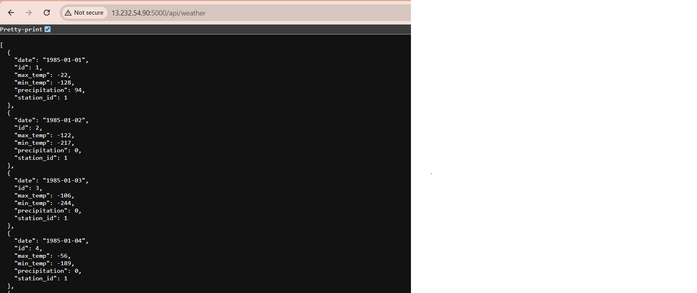

# MLOPS Project - ML Model Data Ingestion

I have created Dockerfiles for both the `web application` (which exposes the API) and the `model database ingestion`. These Dockerfiles are built by GitHub Actions, with workflows located under `.github/workflows`. Once the GitHub Action builds the images, they are pushed to `Docker Hub`. 
  
The Jenkins pipeline, defined in the `Jenkinsfile` under the `/build` directory, is then triggered. Jenkins, running on a multi-node cluster, sets up `Terraform`, which provisions the infrastructure on AWS. 

Ansible configures a multi-node Kubernetes cluster, and the deployment files in the `deploy` directory are used to deploy the application, with the web application service exposed on a `NodePort`. The Docker Hub repositories for the images are available at model-expose-app and weather-db-ingestion-model.
  
- https://hub.docker.com/r/jinny1/model-expose-app
- https://hub.docker.com/r/jinny1/weather-db-ingestion-model

## Architecture Diagram


## WebApp Overview

- We are going to expose below API's `/api/weather` and `/api/weather/stats`.



### Code Explanation

This project consists of Python scripts that use SQLAlchemy to manage and ingest weather data into a PostgreSQL database. The project includes three main components: `PostgreSQL Database` , `Data Ingestion` and `Webapp`. The model ingestion code is present under `./backend` directory, and the WebApp code is present in the `app.py`

- Files and Components
    - *create_db.model.py*

        - Purpose: Defines the database schema and sets up the initial database structure.
        - Key Components:
            -  SQLAlchemy Engine: Establishes a connection to a PostgreSQL database using the provided DATABASE_URL.
            - Declarative Base: Base is used as the base class for all ORM models.
          - Models:
            - WeatherStation: Represents a weather station with fields for station_id, location, latitude, and longitude.
            - WeatherData: Represents weather data associated with a specific station, including date, max_temp, min_temp, and precipitation.
            - Unique Constraint: Ensures that no duplicate records exist for the same station_id and date.
          
      - *ingest_data.py*

          - Purpose: Ingests weather data from text files into the PostgreSQL database.
          - Key Components:
              - Logging: Configures logging to track the ingestion process.
              - Database Connection: Establishes a session with the database using SQLAlchemy.
              - Data Ingestion:
                - Reads text files from the specified directory.
                - Cleans the data by replacing missing values (-9999) with NULL.
                - Inserts data into the WeatherData table while checking for duplicates.
                - Execution: The script is executed with a specified directory containing weather data files.

    - *app.py*
        - This `app.py` file is a Flask application designed to provide a RESTful API for accessing and analyzing weather data stored in a PostgreSQL database. The application uses SQLAlchemy for database interactions and Marshmallow for serialization.

        - Components
            - The Flask app is initialized and configured to connect to a PostgreSQL database using SQLAlchemy.
            - Marshmallow is integrated with the app to handle object serialization and deserialization.
            
            - Database Models

              - WeatherData: A SQLAlchemy model representing the `weather_data` table in the database.
    
                  - `id` : Primary key.
                  - `date` : Date of the weather record.
                  - `station_id`: ID of the weather station.
                  - `max_temp`: Maximum temperature recorded (in Celsius).
                  - `min_temp`: Minimum temperature recorded (in Celsius).
                  - `precipitation`: Precipitation recorded (in millimeters).
            
              - API Routes

                - GET `/api/weather`:
                  Retrieves weather data records based on optional query parameters date and station_id.
                  Returns a JSON array of weather data matching the provided filters.
                  
                - GET `/api/weather/stats`:
                  Retrieves aggregated statistics for weather data, including average max/min temperatures and total precipitation for each station by year.


## Project Overview - Create The End-To-End Devops Pipeline

### Step 1: Fork and Customize Repository

- Fork this repository and make any customizations if needed.

### Step 2: Set Up Jenkins Server on AWS EC2 Instance

- Create an EC2 instance on AWS with security group rules allowing ports 8080 and 50000.
- Install Docker on the instance.
- Configure Jenkins using the following command:
  ```bash
  docker run -d -v jenkins_home:/var/jenkins_home -p 8080:8080 -p 50000:50000 --restart=on-failure jenkins/jenkins:lts-jdk17
- Access Jenkins at http://<your-instance-ip>:8080, configure Jenkins, and install suggested plugins.

### Step 3: Configure Jenkins Worker Node
- Launch a second EC2 instance and configure it as a Jenkins worker node using the steps in the `JenkinsSlaveEc2Node` file.

### Step 4: Create Jenkins Pipeline
- Create a pipeline in Jenkins named "mypipeline" with the repository location and enable the webhook.

### Step 5 Configure GitHub Webhook 
- Add a webhook to your GitHub repository with the Jenkins URL: http://<your-jenkins-ip>:8080/github-webhook/.
- Select only the push event.

### Step 6 Configure DockerHub Credentials 
- As we are using GitHub Workflows for the Build, Testing, and publishing of my docker image, Hence we need to add DockerHub credentials to GitHub secrets with variables` DockerUsername` and `DockerPassword`.

### Step 7 Configure AWS Credentials
- Provide AWS credentials on the Jenkins slave node using _#awS configure_ or store them in Jenkins secrets, and then further add a step in `Jenkinsfile` to configure AWS credentials automatically. Terraform will use these credentials.

### Step 8 Run the Pipeline
- Trigger the pipeline in Jenkins and ensure all steps are executed correctly.

### Step 9 Make Changes and Test
- Make changes in your code locally, push to GitHub, and create a pull request.
- GitHub Actions will build, and push the Docker image.
- Merge the pull request to trigger the Jenkins pipeline(via webhooks), Which will deploy your app on top of k8s cluster

### Step 10: Jenkins Pipeline Stages
- Git
- Setup Ansible
- Setup Terraform
- Create Infrastructure for PROD
- Configure multi node k8s cluster on the created infrastructure
- Deploy the Model, Which will perform data ingestion and api expose
- 

### Step 11: Access the Exposed API
- Login to k8s master node and create a socat, so the webserver can be used from outside the cluster
- Get the IP address which is in the range of 192.168 from this command `hostname -I`  
- Execute this command to start the socat `socat TCP4-LISTEN:5000,fork TCP4:IP:31933`
- Visit http://< K8sMaster-ip >:5000 to see the deployed webserver.


# Action Required: Update CRI-O Installation URL

- Issue:

The CRI-O RPM file URL in the deploy/playbooks/rhel_common.yaml file on line 55 is subject to frequent changes. The current command used for installation is:

`yum install https://download.opensuse.org/repositories/isv:/kubernetes:/addons:/cri-o:/prerelease:/v1.29:/build/rpm/x86_64/cri-o-1.29.7~dev-150500.16.1.x86_64.rpm -y`

- Required Action:

1) Immediate Update:

Update the URL to the latest version. You can find the updated URL from the CRI-O artifacts here.
`https://download.opensuse.org/repositories/isv:/kubernetes:/addons:/cri-o:/prerelease:/v1.29:/build/rpm/x86_64/`

2) Long-term Solution:

Instead of manually updating the URL every time, we can consider configuring a yum repository for CRI-O. This will allow the playbook to pull the latest version automatically, reducing the need for manual intervention.
This approach will streamline the process and ensure that the playbook remains up-to-date with the latest CRI-O version.
